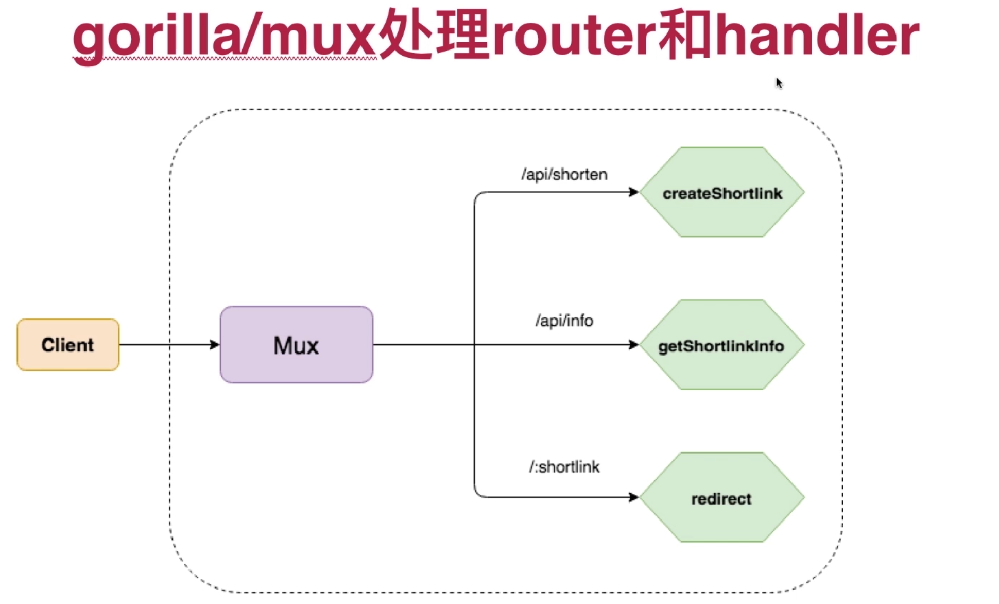

# Go开发短地址服务

短链接经常出现在微博和twitter上，他用来把一个长地址缩短到很短的地址。很好奇他是怎么把长地址和短地址做到一一对应，而且又不重复的呢？这个项目将会体现如何用Go来实现短地址服务。

## 1、Mux处理router和handler

## 2、Mux处理router和handler

## 3、Mux处理router和handler

## 4、Mux处理router和handler

## 5、Mux处理router和handler

